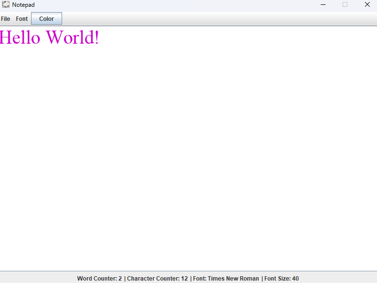

# Notepad Application

This is a **Notepad** project developed in Java using **Swing**. The application includes features such as opening, editing, and saving text files, as well as customizing font, size, and text color.



---

## Features
- **Open Files**: Use the menu to select and open `.txt` files.
- **Save Files**: Save the edited text to a file.
- **Word and Character Counter**: Displays the count of words and characters in real time.
- **Font Customization**: Change the font and text size through the menu.
- **Text Color Selection**: Modify the text color using a color picker.
- **Auto Scrolling**: Scroll automatically when text exceeds the screen size.
- **Custom Icon**: The application includes a custom icon.

---

## Technologies Used
- **Java** (Swing and AWT for graphical interface)
- **JFileChooser**: For file selection.
- **JColorChooser**: For color selection.
- **JMenuBar** and **JSpinner**: To create menus and font control.

---

## How to Run the Project
1. Clone the repository:
   ```bash
   git clone <REPOSITORY_URL>
   ```
2. Import the project into your favorite IDE (IntelliJ, Eclipse, NetBeans).
3. Compile and run the main file `NotepadFrame.java`.

---

## Example Usage
- **Open a File**:
   1. Go to `File > Open`.
   2. Select a `.txt` file from your system.

- **Save a File**:
   1. Go to `File > Save`.
   2. Choose where to save the file and provide a file name.

- **Change Font and Size**:
   - Access the `Font` menu and select an available option or adjust the size using the **Spinner**.

- **Change Text Color**:
   - Click the `Color` button in the menu bar and select your desired color.
